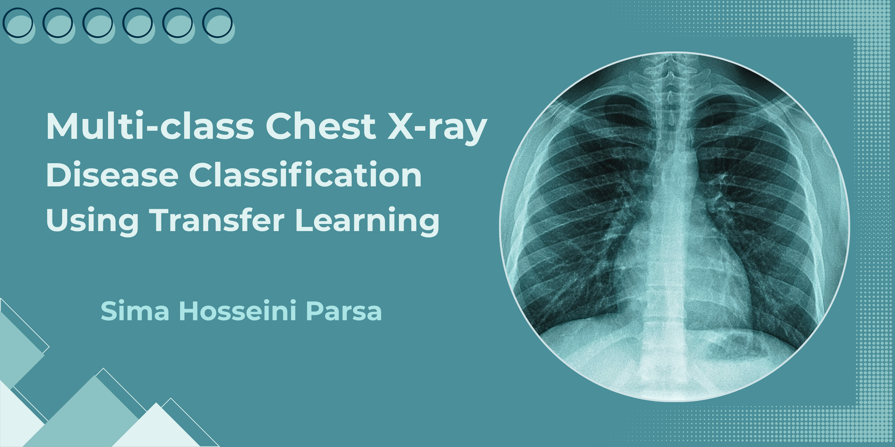
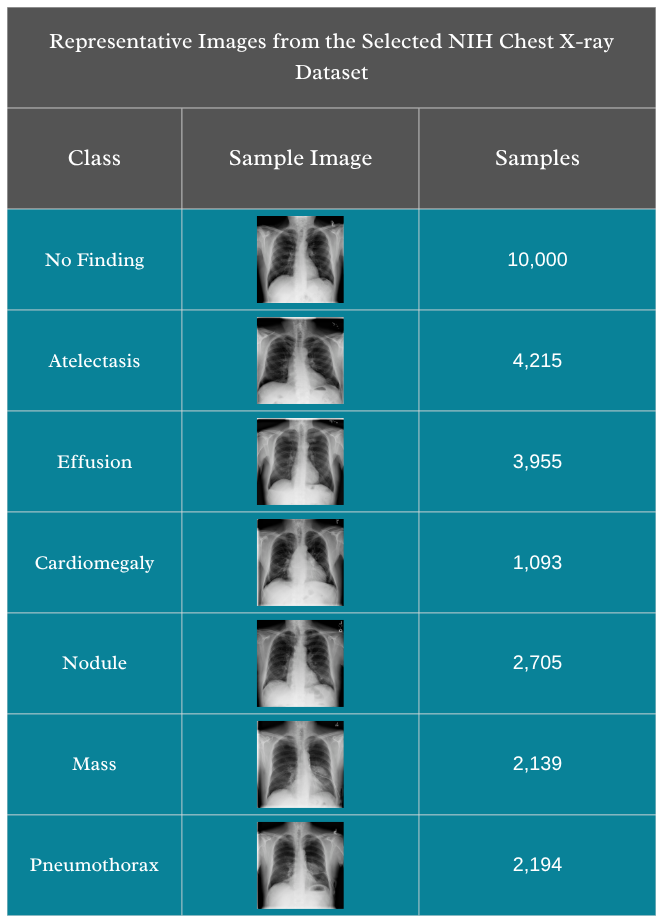
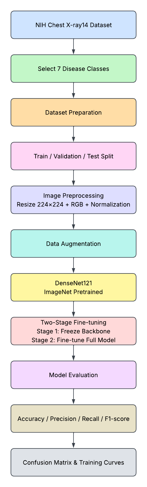
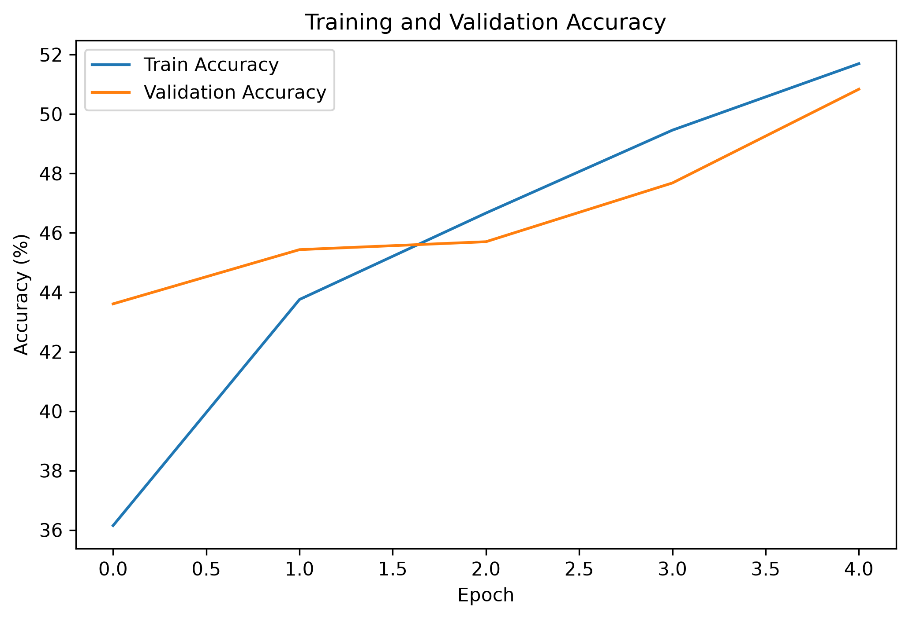
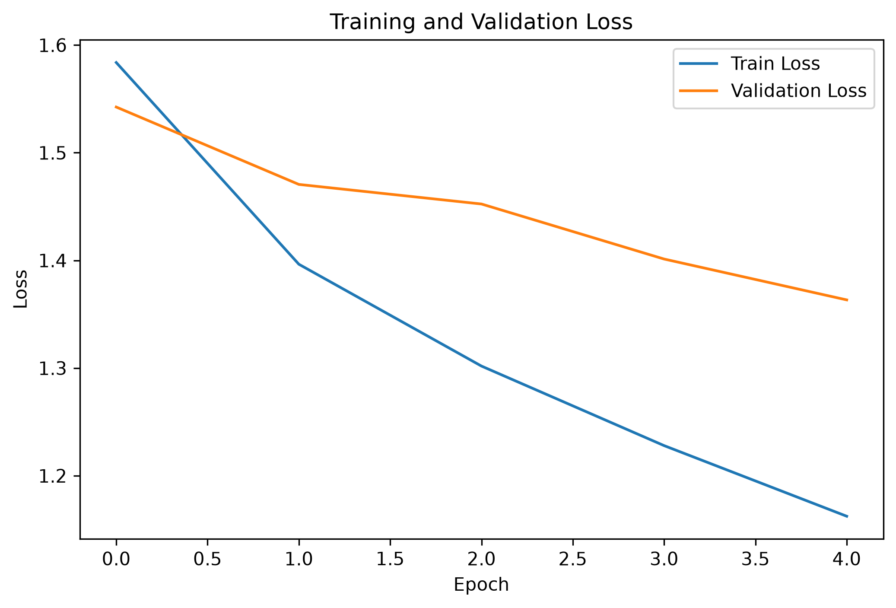
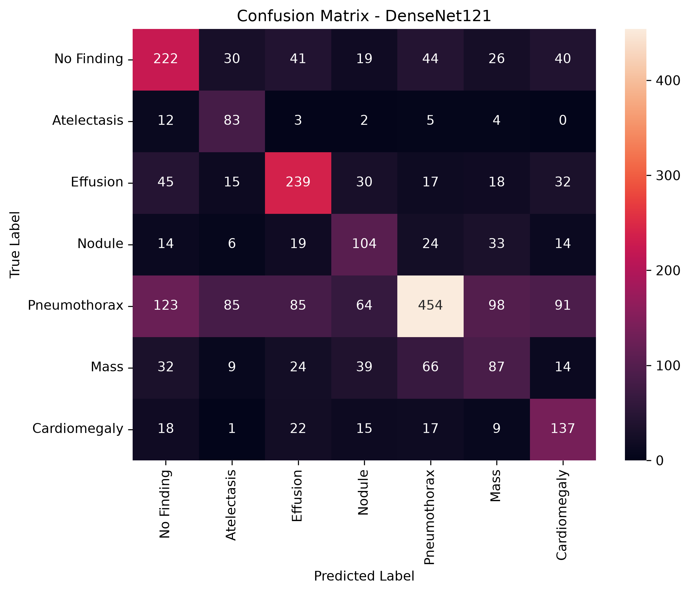

<p align="center">
  
</p>

# Multi-class-Chest-X-ray-Disease-Classification-Using-Transfer-Learning

## Overview

This project presents a deep learning approach for multi-class chest X-ray disease classification using transfer learning. A pretrained DenseNet121 model was fine-tuned on a custom seven-class subset of the NIH ChestX-ray14 dataset to classify seven thoracic disease categories. The project covers the complete workflow, including data preprocessing, augmentation, model training, evaluation, and performance visualization using PyTorch.

## Key Features

- Multi-class chest X-ray classification using deep learning and transfer learning
- Fine-tuning of a pretrained DenseNet121 model for medical image classification
- Custom seven-class subset preparation from the NIH ChestX-ray14 dataset
- Data preprocessing and augmentation pipeline for improved model generalization
- Class imbalance handling using weighted loss function
- Model evaluation using accuracy, precision, recall, F1-score, and confusion matrix
- Visualization of training performance through loss and accuracy curves

## Dataset

This project uses the NIH ChestX-ray14 dataset, a large-scale chest X-ray dataset containing over 100,000 frontal-view chest radiographs with multiple thoracic disease labels.

For this project, a custom seven-class subset was created by selecting seven disease categories from the original dataset:

- No Finding
- Atelectasis
- Effusion
- Nodule
- Pneumothorax
- Mass
- Cardiomegaly

The selected seven-class subset created from the NIH ChestX-ray14 dataset is illustrated below:

<p align="center">
  
</p>

<p align="center">
  Class distribution and representative chest X-ray samples from the custom seven-class subset.
</p>

The final dataset was divided into training, validation, and test sets:

| Split | Number of Images |
|------|------------------|
| Train | 21,040 |
| Validation | 2,630 |
| Test | 2,631 |
| Total | 26,301 |

## Project Structure

```text
Multi-class-Chest-X-ray-Disease-Classification-Using-Transfer-Learning/
│
├── README.md
├── Project_Report.pdf
├── requirements.txt
│
├── notebooks/
│   └── NIH_Chest_Xray_Classification.ipynb
│
├── data_preparation/
│   └── Selected_Classes.ipynb
│
├── images/
│   ├── xray_banner.png
│   ├── sample_xrays.png
│   └── pipeline.png
│
└── results/
    ├── accuracy_curve.png
    ├── loss_curve.png
    ├── confusion_matrix.png
    ├── classification_report.txt
    └── metrics.txt
```
## Project Pipeline

<p align="center">
  
</p>

<p align="center">
  Complete workflow of the proposed chest X-ray classification pipeline.
</p>

## Data Preprocessing

Before training, all chest X-ray images were resized to **224 × 224** pixels and normalized using the ImageNet mean and standard deviation to match the pretrained DenseNet121 model.
 The original chest X-ray images were grayscale. During image loading, the torchvision ImageFolder pipeline provided a three-channel RGB representation, enabling the use of the ImageNet-pretrained DenseNet121 model.
To improve model generalization, data augmentation was applied to the training set using:

- Resize (224 × 224)
- Random Horizontal Flip
- Random Rotation (10°)
- ImageNet normalization

The validation and test sets were resized and normalized without data augmentation to ensure a fair evaluation.

## Training Configuration

During model development, different fine-tuning strategies were evaluated. Initially, the pretrained DenseNet121 model was trained using full fine-tuning. After analyzing the training behavior and results, a two-stage fine-tuning strategy was adopted to improve model performance.

The final model was trained using the following two-stage fine-tuning approach:

**Stage 1:**
- The pretrained DenseNet121 backbone was frozen.
- Only the final classification layer was trained.

**Stage 2:**
- The backbone layers were unfrozen.
- The entire model was fine-tuned on the custom seven-class chest X-ray dataset.

A learning rate scheduling strategy using ReduceLROnPlateau was also investigated during training to improve optimization. Based on the evaluation results, the two-stage fine-tuning approach provided better performance and was selected as the final training strategy.
Training configuration:
- Model: DenseNet121 with pretrained ImageNet weights for seven-class chest X-ray classification
- Optimizer: Adam
- Learning rate: 0.0001
- Batch size: 32
- Loss function: Cross-Entropy Loss with class weights
- Input size: 224 × 224 pixels

## Results

The model was evaluated on the test set using standard classification metrics, including **accuracy, precision, recall, and F1-score**. A confusion matrix was also generated to analyze the model's performance across the seven disease categories.

## Results Summary

| Metric | Value |
|---|---|
| Accuracy | 50.40% |
| Precision | 54.81% |
| Recall | 50.40% |
| F1-score | 50.87% |

### Training Performance

<p align="center">
  
  
</p>

### Confusion Matrix

<p align="center">
  
</p>

The complete evaluation results are available in:

- `results/metrics.txt`
- `results/classification_report.txt`

## Visualization

Training progress and model evaluation results are visualized using:

- Accuracy curve
- Loss curve
- Confusion matrix

The generated visualizations are available in the `results` folder.

## Installation

This project was developed using Python 3.12.

Install the required Python libraries using:

```bash
pip install -r requirements.txt
```
The project is implemented using Jupyter Notebook. After installing the dependencies, open the notebook files and run the cells sequentially.

## Usage

After installing the required dependencies, open the Jupyter Notebook files and run the cells sequentially.

The main training and evaluation pipeline is available in:

`notebooks/NIH_Chest_Xray_Classification.ipynb`

The dataset preparation process is available in:

`data_preparation/Selected_Classes.ipynb`

## Requirements

Main libraries used in this project:

- PyTorch
- Torchvision
- NumPy
- Pandas
- Scikit-learn
- Matplotlib
- Seaborn

All dependencies are provided in the `requirements.txt` file.

## Acknowledgments

This project uses the NIH ChestX-ray14 dataset, provided by the National Institutes of Health Clinical Center.

Dataset reference:
- Wang et al., "ChestX-ray8: Hospital-scale Chest X-ray Database and Benchmarks on Weakly-Supervised Classification and Localization of Common Thorax Diseases", CVPR 2017.
- The dataset was later expanded and released as NIH ChestX-ray14.
The implementation of this project was developed using PyTorch and Torchvision.

## Future Improvements

Possible future improvements for this project include:

- Comparing the performance of DenseNet121 with other pretrained architectures such as ResNet and EfficientNet.
- Exploring more advanced fine-tuning strategies and learning rate scheduling techniques.
- Applying additional data augmentation methods to improve model generalization.
- Investigating alternative approaches for handling class imbalance in multi-class chest X-ray classification.
- Incorporating explainable AI (XAI) methods such as Grad-CAM to better understand model predictions.
- Evaluating the model on additional chest X-ray datasets to assess its generalization capability.
